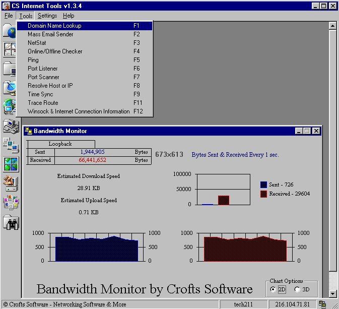

## CS Internet Tools

### Description

Has many tools and features. I found a lot of code to help make this and alot of it is my own.

Please vote and take a look at the pic for all the tools that are in the program. Also I have included a startup and shutdown sound. Enjoy!

webmaster@croftssoftware.com
 
### More Info
 

             |
---                |---
**Submitted On**   |2001-08-02 11:57:10
**By**             |[Shane Croft](https://github.com/Planet-Source-Code/PSCIndex/blob/master/ByAuthor/shane-croft.md)
**Level**          |Advanced
**User Rating**    |4.8 (197 globes from 41 users)
**Compatibility**  |VB 6\.0
**Category**       |[Complete Applications](https://github.com/Planet-Source-Code/PSCIndex/blob/master/ByCategory/complete-applications__1-27.md)
**World**          |[Visual Basic](https://github.com/Planet-Source-Code/PSCIndex/blob/master/ByWorld/visual-basic.md)
**Archive File**   |[CS Interne23967822001\.zip](https://github.com/Planet-Source-Code/shane-croft-cs-internet-tools__1-25784/archive/master.zip)

